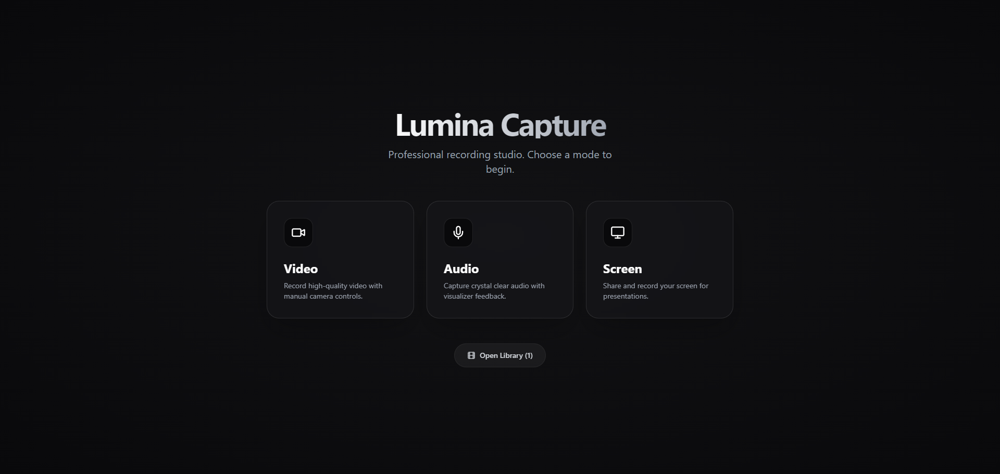

<div align="center">
  
</div>

# Lumina Capture

**Lumina Capture** is a professional-grade web-based recording studio built with React and TypeScript. It offers a premium, modern interface to capture video, audio, and screen recordings directly from your browser.

## ✨ Features

- **🎥 Professional Video Recording**: Capture high-quality video up to 4K resolution. Support for multiple camera inputs and mirroring.
- **🎤 Advanced Audio Recording**: Record crystal-clear audio with a built-in real-time visualizer.
- **🖥️ Smart Screen Recording**: Share and record your screen for presentations, tutorials, or gameplay, complete with Picture-in-Picture (PiP) camera overlay.
- **📂 Local Library Management**: Instant access to your recordings with an integrated gallery. Rename, download, or delete files with ease.
- **🌗 Modern UI**: specialized dark mode interface designed for focus and clarity.

## 🛠️ Tech Stack

- **Framework**: [React 19](https://react.dev/)
- **Build Tool**: [Vite](https://vitejs.dev/)
- **Styling**: [Tailwind CSS](https://tailwindcss.com/)
- **Icons**: [Lucide React](https://lucide.dev/)
- **Language**: TypeScript

## 🚀 Run Locally

1. **Install dependencies:**
   ```bash
   npm install
   ```

2. **Start the development server:**
   ```bash
   npm run dev
   ```

3. **Open your browser:**
   Navigate to `http://localhost:5173` (or the URL shown in your terminal).

## 📦 Build for Production

To create a production-ready build:

```bash
npm run build
```

The output will be in the `dist` directory.

## 📝 License

This project is open source and available for personal use.
